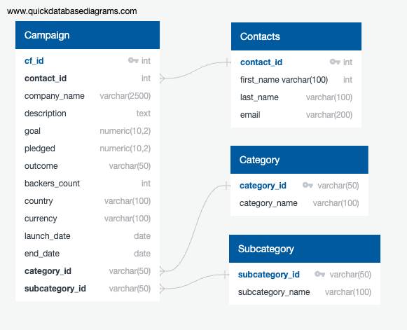

# Project 2: ETL_Mini_Project

## Introduction
This project focuses on data extraction, transformation, and loading (ETL). Two Excel files, [contacts.xlsx](Resources/contacts.xlsx) and [crowdfunding.xlsx](Resources/crowdfunding.xlsx), were taken into a Pandas Dataframe and transformed to create the four CSV files. This, in turn, was used to develop the crowdfunding SQL database.

## Extraction and Transformation
The extraction and transformation workings can be seen in the annotated [Jupyter Notebook](ETL_Mini_Project_ALee_AConlon_AMaryam_MVeerabahu_ZAkinwale.ipynb) which creates the four CSV files. Pandas module in Python code were used to extract the data from the Excel file and transformed to generate the following 4 CSV files:

- [campaign.csv](Outputs/campaign.csv)
- [category.csv](Outputs/category.csv)
- [contacts.csv](Outputs/contacts.csv)
- [subcategory.csv](Outputs/subcategory.csv)

## Loading to Database
The CSV files were used to create the following Entity Relationship Diagram. 



The database was built using PostgreSQL using the following [Schema](crowdfunding_db_schema.sql). Four tables were created for each of the CSV files, and they were manually uploaded to the database. The tables were joined using Primary and Foreign keys as specified in the Entity Relationship diagram. 
The following care small snippets of the the ```SELECT *``` query for each table.

#### Campaign Table

#### Category Table
#### Contacts Table
#### Subcategory Table


