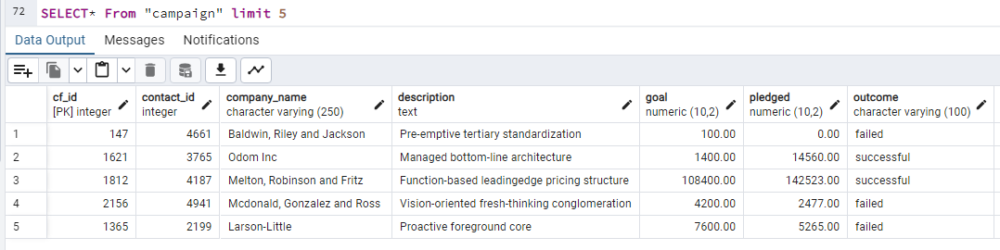

# Project 2: ETL_Mini_Project

This project focuses on data extraction, transformation, and loading (ETL). Two Excel files, [contacts.xlsx](Resources/contacts.xlsx) and [crowdfunding.xlsx](Resources/crowdfunding.xlsx), were taken into a Pandas Dataframe and transformed to create the following four CSV files.

- [campaign.csv](Outputs/campaign.csv)
- 

